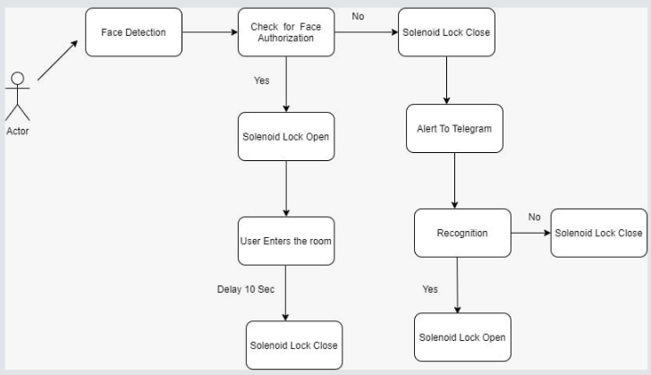

# IOT-esp32-cam
## Smart Door Lock System using esp32-cam and Telegram chatbot 


Home automation gives you access to control devices in your home from a mobile device anywhere in the world. One of the biggest advantages of home automation is that it keeps your abode safe, and prevents accidental fires, water leaks, gas leaks, and other disasters. This project shows how we can use Telegram in our IoT and Home Automation projects. Home Security System using ESP32 CAM which will notify us on Telegram App about person entering the house by capturing and sending his photo to us and Door can be controlled by chatbot. With this project we can take multiple photos, unlock and lock the door from anywhere in the world with the Telegram app.

## Version 1: [Code](esp32cam_telegram_smart_door_lock.ino)

When anyone presses the doorbell, home owner  will get a notification in the telegram app with a photo of that person. After that, we can easily unlock and lock the door from the telegram app.

### Explanation

Importing Libraries
Start by importing the required libraries.
```ino
#include <Arduino.h>
#include <WiFi.h>
#include <WiFiClientSecure.h>
#include "soc/soc.h"
#include "soc/rtc_cntl_reg.h"
#include "esp_camera.h"
#include <UniversalTelegramBot.h>
#include <ArduinoJson.h>
```

fullcode
```c++


//const char* ssid = "JioFiber- 4G";
//const char* password = "qwerty789";

const char* ssid = "Mozambi";
const char* password = "olejidbt";


// Initialize Telegram BOT
//String BOTtoken = "1952601363:AAGD2wTgaSyFmrUKwzL7wmDZ_cjdTyKXP4I";  // your Bot Token (Get from Botfather) bot 1
String BOTtoken = "2077344860:AAHwzob--KiRLLMzTPLnxWCoaGXQu7p5hic";  //bot 2

String CHAT_ID = "818073028";

bool sendPhoto = false;

WiFiClientSecure clientTCP;
UniversalTelegramBot bot(BOTtoken, clientTCP);

#define FLASH_LED_PIN 4
bool flashState = LOW;

//Checks for new messages every 1 second.
int botRequestDelay = 1000;
unsigned long lastTimeBotRan;

//CAMERA_MODEL_AI_THINKER
#define PWDN_GPIO_NUM     32
#define RESET_GPIO_NUM    -1
#define XCLK_GPIO_NUM      0
#define SIOD_GPIO_NUM     26
#define SIOC_GPIO_NUM     27

#define Y9_GPIO_NUM       35
#define Y8_GPIO_NUM       34
#define Y7_GPIO_NUM       39
#define Y6_GPIO_NUM       36
#define Y5_GPIO_NUM       21
#define Y4_GPIO_NUM       19
#define Y3_GPIO_NUM       18
#define Y2_GPIO_NUM        5
#define VSYNC_GPIO_NUM    25
#define HREF_GPIO_NUM     23
#define PCLK_GPIO_NUM     22


// Define GPIOs
#define BUTTON 13
#define LOCK 12
#define LOCK2 14
#define LOCK3 15
#define FLASH_LED 4

int lockState = 0;
String r_msg = "";

String unlockDoor(){  
 if (lockState == 0) {
  digitalWrite(LOCK, HIGH);

  
  lockState = 1;
  delay(100);
  return "Door Unlocked. /lock";
 }
 else{
  return "Door Already Unlocked. /lock";
 }  
}
String lockDoor(){
 if (lockState == 1) {
  digitalWrite(LOCK, LOW);

  lockState = 0;
  delay(100);
  return "Door Locked. /unlock";
 }
 else{
  return "Door Already Locked. /unlock";
 }
}


void configInitCamera(){
  camera_config_t config;
  config.ledc_channel = LEDC_CHANNEL_0;
  config.ledc_timer = LEDC_TIMER_0;
  config.pin_d0 = Y2_GPIO_NUM;
  config.pin_d1 = Y3_GPIO_NUM;
  config.pin_d2 = Y4_GPIO_NUM;
  config.pin_d3 = Y5_GPIO_NUM;
  config.pin_d4 = Y6_GPIO_NUM;
  config.pin_d5 = Y7_GPIO_NUM;
  config.pin_d6 = Y8_GPIO_NUM;
  config.pin_d7 = Y9_GPIO_NUM;
  config.pin_xclk = XCLK_GPIO_NUM;
  config.pin_pclk = PCLK_GPIO_NUM;
  config.pin_vsync = VSYNC_GPIO_NUM;
  config.pin_href = HREF_GPIO_NUM;
  config.pin_sscb_sda = SIOD_GPIO_NUM;
  config.pin_sscb_scl = SIOC_GPIO_NUM;
  config.pin_pwdn = PWDN_GPIO_NUM;
  config.pin_reset = RESET_GPIO_NUM;
  config.xclk_freq_hz = 20000000;
  config.pixel_format = PIXFORMAT_JPEG;

  //init with high specs to pre-allocate larger buffers
  if(psramFound()){
    config.frame_size = FRAMESIZE_UXGA;
    config.jpeg_quality = 10;  //0-63 lower number means higher quality
    config.fb_count = 2;
  } else {
    config.frame_size = FRAMESIZE_SVGA;
    config.jpeg_quality = 12;  //0-63 lower number means higher quality
    config.fb_count = 1;
  }
  
  // camera init
  esp_err_t err = esp_camera_init(&config);
  if (err != ESP_OK) {
    Serial.printf("Camera init failed with error 0x%x", err);
    delay(1000);
    ESP.restart();
  }

  // Drop down frame size for higher initial frame rate
  sensor_t * s = esp_camera_sensor_get();
  s->set_framesize(s, FRAMESIZE_CIF);  // UXGA|SXGA|XGA|SVGA|VGA|CIF|QVGA|HQVGA|QQVGA
}

//void handleNewMessages(int numNewMessages) {
//  Serial.print("Handle New Messages: ");
//  Serial.println(numNewMessages);
//
//  for (int i = 0; i < numNewMessages; i++) {
//    String chat_id = String(bot.messages[i].chat_id);
//    if (chat_id != CHAT_ID){
//      bot.sendMessage(chat_id, "Unauthorized user", "");
//      continue;
//    }
//    
//    // Print the received message
//    String text = bot.messages[i].text;
//    Serial.println(text);
//    
//    String from_name = bot.messages[i].from_name;
//    if (text == "/start") {
//      String welcome = "Welcome , " + from_name + "\n";
//      welcome += "Use the following commands to interact with the ESP32-CAM \n";
//      welcome += "/photo : takes a new photo\n";
//      welcome += "/flash : toggles flash LED \n";
//      bot.sendMessage(CHAT_ID, welcome, "");
//    }
//    if (text == "/flash") {
//      flashState = !flashState;
//      digitalWrite(FLASH_LED_PIN, flashState);
//      Serial.println("Change flash LED state");
//    }
//    if (text == "/photo") {
//      sendPhoto = true;
//      Serial.println("New photo request");
//    }
//  }
//}
void handleNewMessages(int numNewMessages){
  Serial.print("Handle New Messages: ");
  Serial.println(numNewMessages);

  for (int i = 0; i < numNewMessages; i++){
    // Chat id of the requester
    String chat_id = String(bot.messages[i].chat_id);
    if (chat_id != CHAT_ID){
      bot.sendMessage(chat_id, "Unauthorized user", "");
      continue;
    }
    
    // Print the received message
    String text = bot.messages[i].text;
    Serial.println(text);

    String fromName = bot.messages[i].from_name;
    if (text == "/photo") {
      sendPhoto = true;
      Serial.println("New photo request");
    }
//    if (text == "/flash") {
//      digitalWrite(FLASH_LED, !FLASH_LED);
//      Serial.println("New Flash request");
//    }
    if (text == "/lock"){
      String r_msg = lockDoor();
      bot.sendMessage(CHAT_ID, r_msg, "");
    }
    if (text == "/unlock"){
      String r_msg = unlockDoor();
      bot.sendMessage(CHAT_ID, r_msg, "");
    }
    if (text == "/start"){
      String welcome = "Welcome to the ESP32-CAM Telegram Smart Lock.\n";
      welcome += "/photo : Takes a new photo\n";
      welcome += "/flash : To toggle Flashlight\n";
      welcome += "/unlock : Unlock the Door\n\n";
      welcome += "/lock : Lock the Door\n";
      welcome += "To get the photo please tap on /photo.\n";
      bot.sendMessage(CHAT_ID, welcome, "Markdown");
    }
    if (text == "/flash") {
      flashState = !flashState;
      String r_msg = "Flash toggled";
      bot.sendMessage(CHAT_ID, r_msg, "");
      digitalWrite(FLASH_LED_PIN, flashState);
      Serial.println("Change flash LED state");
    }
  }
}


String sendPhotoTelegram() {
  const char* myDomain = "api.telegram.org";
  String getAll = "";
  String getBody = "";

  camera_fb_t * fb = NULL;
  fb = esp_camera_fb_get();  
  if(!fb) {
    Serial.println("Camera capture failed");
    delay(1000);
    ESP.restart();
    return "Camera capture failed";
  }  
  
  Serial.println("Connect to " + String(myDomain));


  if (clientTCP.connect(myDomain, 443)) {
    Serial.println("Connection successful");
    
    String head = "--IMG_share\r\nContent-Disposition: form-data; name=\"chat_id\"; \r\n\r\n" + CHAT_ID + "\r\n--IMG_share\r\nContent-Disposition: form-data; name=\"photo\"; filename=\"esp32-cam.jpg\"\r\nContent-Type: image/jpeg\r\n\r\n";
    String tail = "\r\n--IMG_share--\r\n";

    uint16_t imageLen = fb->len;
    uint16_t extraLen = head.length() + tail.length();
    uint16_t totalLen = imageLen + extraLen;
  
    clientTCP.println("POST /bot"+BOTtoken+"/sendPhoto HTTP/1.1");
    clientTCP.println("Host: " + String(myDomain));
    clientTCP.println("Content-Length: " + String(totalLen));
    clientTCP.println("Content-Type: multipart/form-data; boundary=IMG_share");
    clientTCP.println();
    clientTCP.print(head);
  
    uint8_t *fbBuf = fb->buf;
    size_t fbLen = fb->len;
    for (size_t n=0;n<fbLen;n=n+1024) {
      if (n+1024<fbLen) {
        clientTCP.write(fbBuf, 1024);
        fbBuf += 1024;
      }
      else if (fbLen%1024>0) {
        size_t remainder = fbLen%1024;
        clientTCP.write(fbBuf, remainder);
      }
    }  
    
    clientTCP.print(tail);
    
    esp_camera_fb_return(fb);
    
    int waitTime = 10000;   // timeout 10 seconds
    long startTimer = millis();
    boolean state = false;
    
    while ((startTimer + waitTime) > millis()){
      Serial.print(".");
      delay(100);      
      while (clientTCP.available()) {
        char c = clientTCP.read();
        if (state==true) getBody += String(c);        
        if (c == '\n') {
          if (getAll.length()==0) state=true; 
          getAll = "";
        } 
        else if (c != '\r')
          getAll += String(c);
        startTimer = millis();
      }
      if (getBody.length()>0) break;
    }
    clientTCP.stop();
    Serial.println(getBody);
  }
  else {
    getBody="Connected to api.telegram.org failed.";
    Serial.println("Connected to api.telegram.org failed.");
  }
  return getBody;
}

void setup(){
  pinMode(LOCK,OUTPUT);
  WRITE_PERI_REG(RTC_CNTL_BROWN_OUT_REG, 0); 
  // Init Serial Monitor
  Serial.begin(115200);

  // Set LED Flash as output
  pinMode(FLASH_LED_PIN, OUTPUT);
  digitalWrite(FLASH_LED_PIN, flashState);

  // Config and init the camera
  configInitCamera();

  // Connect to Wi-Fi
  WiFi.mode(WIFI_STA);
  Serial.println();
  Serial.print("Connecting to ");
  Serial.println(ssid);
  WiFi.begin(ssid, password);
  clientTCP.setCACert(TELEGRAM_CERTIFICATE_ROOT); // Add root certificate for api.telegram.org
  while (WiFi.status() != WL_CONNECTED) {
    Serial.print(".");
    delay(500);
  }
  Serial.println();
  Serial.print("ESP32-CAM IP Address: ");
  Serial.println(WiFi.localIP()); 
}

void loop() {
  if (sendPhoto) {
    Serial.println("Preparing photo");
//    sendPhotoTelegram(); 
//    sendPhoto = false; 
    digitalWrite(FLASH_LED, HIGH);
    delay(200);
    sendPhotoTelegram(); 
    digitalWrite(FLASH_LED, LOW);
    sendPhoto = false; 
  }


  if(digitalRead(BUTTON) == LOW){
    Serial.println("Preparing photo");
      String r_msg = "Button pressed";
      bot.sendMessage(CHAT_ID, r_msg, "");
    digitalWrite(FLASH_LED, HIGH);
    delay(200);
    sendPhotoTelegram(); 
    digitalWrite(FLASH_LED, LOW);
    sendPhoto = false; 
  }
  
  if (millis() > lastTimeBotRan + botRequestDelay)  {
    int numNewMessages = bot.getUpdates(bot.last_message_received + 1);
//    Serial.println(numNewMessages);
    while (numNewMessages) {
      Serial.println("got response");
      handleNewMessages(numNewMessages);
      numNewMessages = bot.getUpdates(bot.last_message_received + 1);
    }
    lastTimeBotRan = millis();
  }
}

```
## Version 2: [Code](esp32-cam_Facerecognition_and_telegram_smartlock.ino)

Some images of authorized people are registered in the esp32-cam with SD card .

when someone is at the door , if the person is recognizable by the esp32cam as an authorized user then Door unlocks , else capture and send an image of the person to the home owner and let him / her take the decision.

## Flowchart :



##  Demo : 

Click on the image below for demo
[](https://youtu.be/Woi7MhA4UIs)
